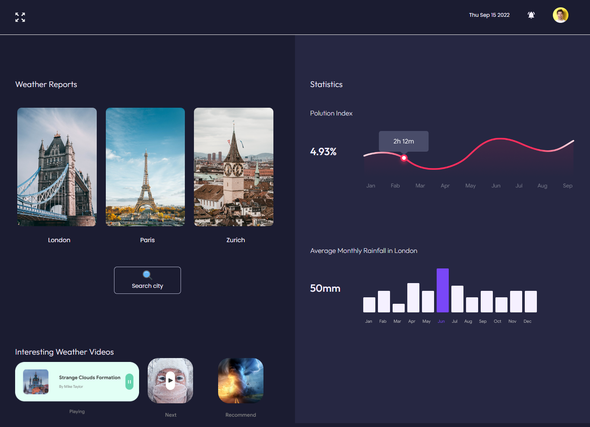
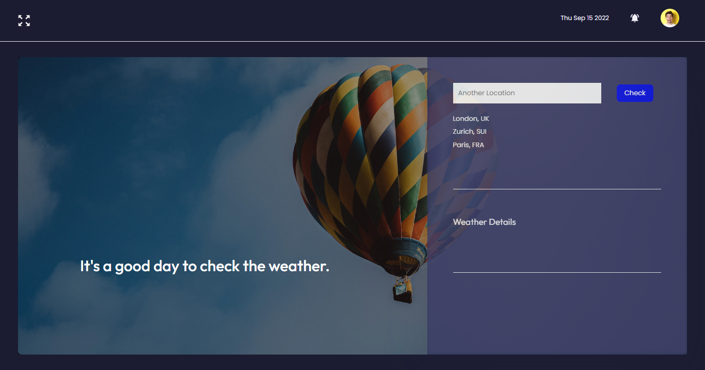
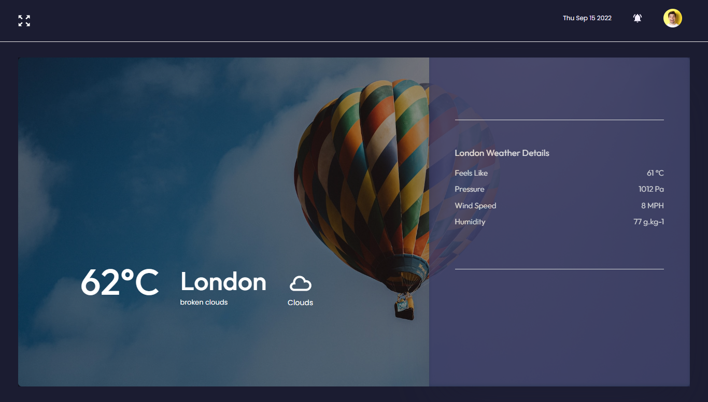

 # Wetter - A Weather Dashboard

Wetter!, your sleek, user-friendly weather forecaster. With a modern user interface, it's 98% accurate!
## Table of contents

- [Overview](#overview)
  - [The Project](#the-project)
  - [Links](#links)
- [My process](#my-process)
  - [Built with](#built-with)
- [Author](#author)

## Overview

### The Project

Major Components of the Project includes

- Optimal layout for the site depending on user's device's screen size
- Responsive Admin dashboard
- API consumption using Axios

### Links

- Live Site URL: https://weather-dasboard.netlify.app/

### Images of the project

### Built with

- React.Js
- React Router
- Axios
- CSS Media Queries
- Netlify
- Mobile-first workflow

## Author

- Twitter - [@jhimmyofficial](https://www.twitter.com/@jhimmyofficial)

## Running the Project

The project was bootstrapped with [Create React App](https://github.com/facebook/create-react-app).

## Available Scripts

In the project directory, you can run:

### `npm start`

Runs the app in the development mode.\
Open [http://localhost:3000](http://localhost:3000) to view it in the browser.